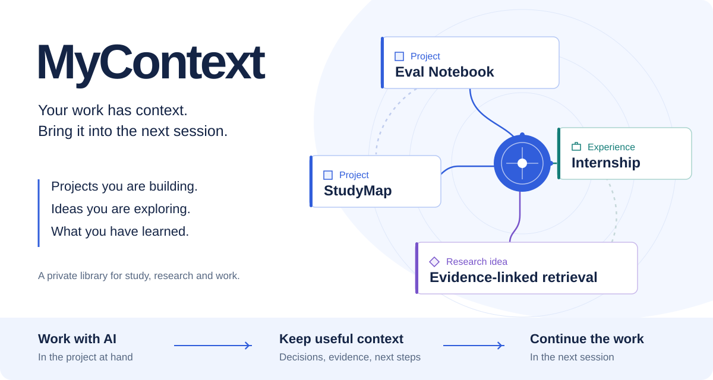
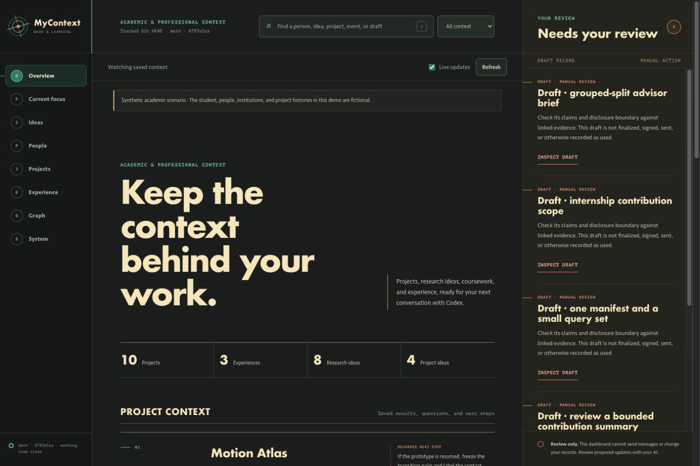
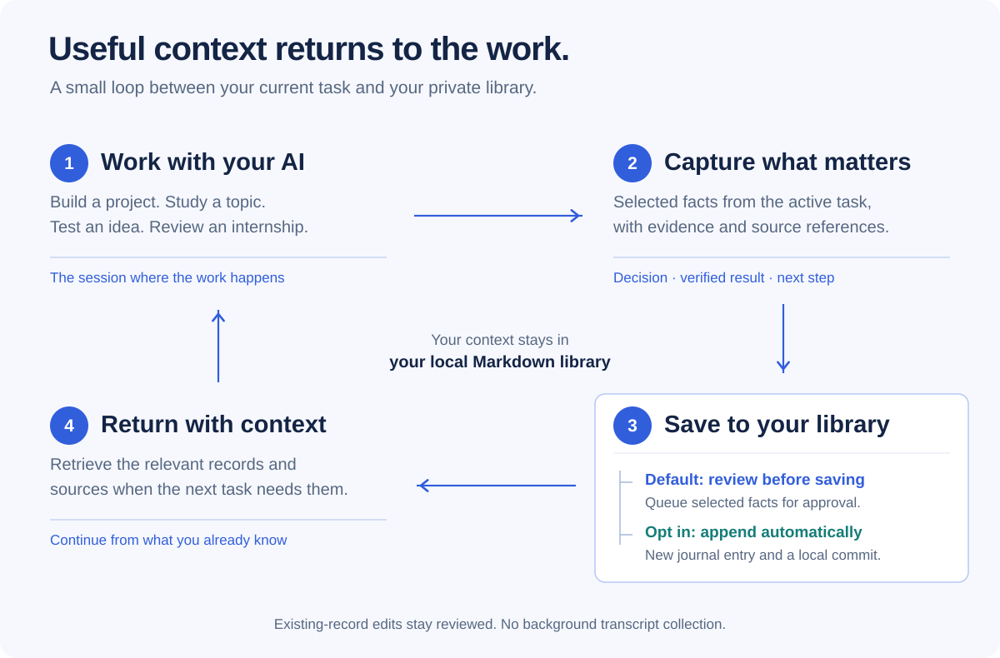

# MyContext

**Your academic and professional context, ready for your next AI session.**

MyContext keeps the context behind your work: what you tried, what you learned,
which evidence supports a result, and what to do next. Use it with Codex or another
local AI assistant to continue a research project, prepare an internship summary,
or return to a course topic without explaining everything again.

[Get started](#get-started) · [Try a scenario](docs/scenarios.md) ·
[Install with your AI](docs/getting-started.md#install-with-your-ai) ·
[中文指南](docs/guide.zh-CN.md)



## See your work in context

The local dashboard brings projects, research ideas, collaborators and experience
together. Open a record to see its current state, supporting notes and unresolved
questions.



*The demo follows Alex Lin, a fictional computer science student. All people,
institutions, experiences and results in its 67 linked records are invented.*

## Four ways to use it

| You are about to… | Ask your assistant… | Context to bring back |
| --- | --- | --- |
| Resume a research experiment | “Why was the earlier result withdrawn, and what should I run next?” | The leakage review, revised split, remaining uncertainty and next comparison |
| Prepare an internship summary | “Help me describe my contribution accurately.” | Your role, project evidence, handover notes and claims still awaiting review |
| Return to a difficult course topic | “What did I understand last time, and where did I get stuck?” | Earlier reasoning, independent attempts and the next practice question |
| Explore a project idea | “What is the smallest useful test before I start building?” | The motivation, constraints and first validation step |

[Walk through these scenarios →](docs/scenarios.md)

## Carry context between sessions

The **My Context Skill** connects your assistant to your library from other
projects. Retrieve the relevant records before starting work; capture useful
outcomes when the session produces something worth keeping.



Capture queues new information for **review by default**. An explicit opt-in can
allow automatic private journal entries and local Git commits. Changes to existing
records still require review. Capture uses selected information from the active
task; it does not collect conversations in the background or automatically push
your notes to a remote.

Your records live in a separate local Git repository as readable Markdown and
YAML. The dashboard displays committed records and is read-only; your AI assistant
handles retrieval and proposed updates.

## Follow the connections

Start from a project, person or idea and explore its neighborhood. Typed
relationships can explain who participates in a project, which note supports a
claim, or what supersedes an earlier result. Open an edge to inspect its evidence;
expand the graph to continue exploring.


Generic links help you navigate. Typed relationships carry recorded meaning.
Suggested connections remain suggestions until reviewed. The graph refreshes when
new context is committed, while keeping your current focus.

[Graph controls and queries →](dashboard/README.md)

## Get started

Requires **Git 2.28+, Node.js 20+, Ruby 2.6+** and a POSIX shell (macOS, Linux or WSL).
The application has no npm or Ruby gem dependencies and needs no API key.

```bash
git clone https://github.com/TheCYPER/MyContext-hackathon.git
cd MyContext-hackathon
npm run setup
npm test
npm start -- --root "$PWD/.local/demo"
```

Open **http://127.0.0.1:4318**. Setup creates an independent fictional demo in
`.local/demo/`. If the port is occupied, use `npm start -- --root "$PWD/.local/demo" --port 4319`.

Prefer to have your AI set it up? Copy the
[complete installation prompt](docs/getting-started.md#install-with-your-ai). It
covers the demo, verification, a blank personal library, and cross-project Skill
setup.

When you are ready to add your own context, follow the
[personal library guide](docs/getting-started.md#use-your-own-context). Start with
one course, internship or project; the initializer leaves your profile blank.

## Guides and reference

- [Getting started](docs/getting-started.md) — installation, your own library and cross-session capture.
- [Scenarios](docs/scenarios.md) — four concrete workflows with demo records and prompts.
- [Demo walkthrough](examples/demo/README.md) — explore the fictional academic workspace.
- [Dashboard guide](dashboard/README.md) — views, graph controls and read-only API.
- [Context schema](meta/schema.md) — record fields, evidence and relationships.
- [Privacy boundaries](SECURITY.md) · [Contributing](CONTRIBUTING.md) · [MIT license](LICENSE)
