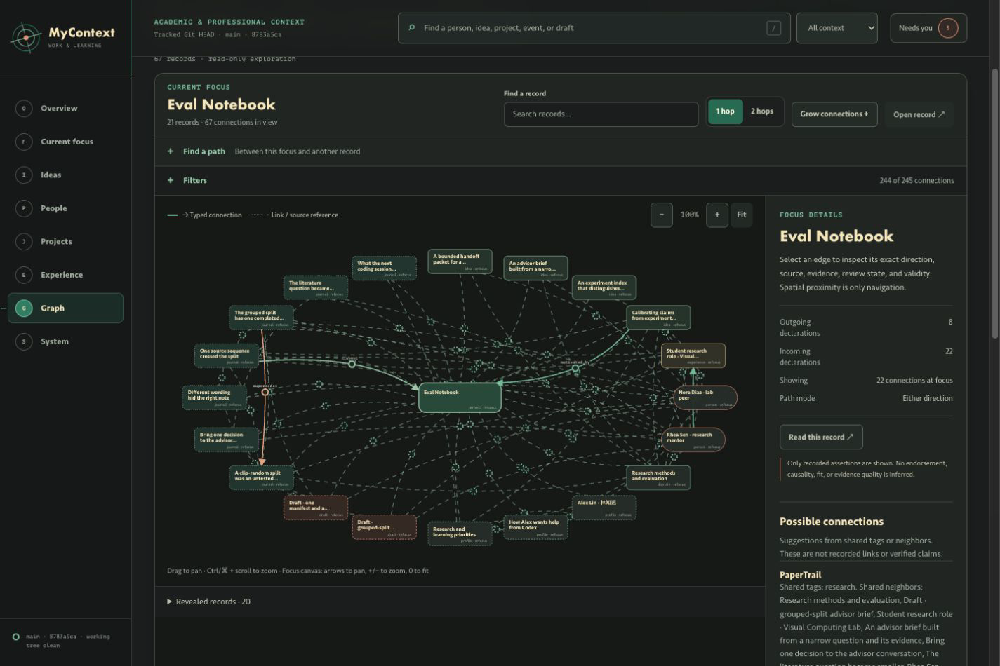

# MyContext dashboard

Browse your projects, internship experiences, research ideas, collaborators, and
work notes in one local view. The dashboard reads the committed records in your
context repository; your AI assistant uses those same records during a task.



## Run locally

From the software directory, create the fictional demo and start the dashboard:

```bash
npm run setup
npm start -- --root "$PWD/.local/demo"
```

Open **http://127.0.0.1:4318**. For prerequisites and a complete AI installation
prompt, see [getting started](../docs/getting-started.md).

To view a different context repository with at least one commit:

```bash
node dashboard/server.mjs --root /absolute/path/to/context --port 4319
```

An explicit `--root` takes precedence over `MY_CONTEXT_ROOT`, then the older
`MYCONTEXT_ROOT` alias. Without these, the dashboard uses `.local/demo/` relative
to the software checkout. `--port` overrides `MYCONTEXT_MARGIN_PORT` and the
default port 4318. The server binds to `127.0.0.1`.

## Explore the graph

1. Use **Find a record** to choose a project, experience, idea, person, or work
   note by its title, ID, or type. Start with one or two hops around it.
2. Use **Grow connections +** to reveal another layer, or **Expand connections +**
   for an individual record. Existing visible records remain visible.
3. Select an assertion in **Connected records** to inspect its meaning, source,
   evidence, and review state. Parallel assertions remain individually accessible.
4. Open **Filters** to select predicates, review states, evidence availability,
   and current validity. The summary reports the active filters and visible count.
5. Expand **Find a path**, select a destination, and choose directed typed
   relations or navigation across visible connections. The complete selected path
   is retained, including steps beyond two hops.

The graph starts with a 200-record display limit, expandable in batches of 100.
Every recorded edge between visible nodes is included. **Needs you** opens the
review drawer while preserving your place in the graph.

| Navigation | Control |
| --- | --- |
| Pan | Drag the canvas, or use arrow keys while it has focus |
| Zoom | Buttons, `+` / `-`, or Ctrl/Cmd + wheel |
| Center the graph | **Fit**, `0`, or Home |
| Return to one hop | **Reset view**; keeps the current filters |
| Choose a search result | Click, or Arrow Up/Down then Enter |
| Close the review drawer | Escape; focus returns to its button |

## Understand the connections

| Connection | What it represents |
| --- | --- |
| Typed relation | A directed assertion such as a person participating in an experience or a journal entry about a project. It keeps its own source, evidence, review state, and optional validity dates. |
| Navigation link | A record's explicit `links` entry. It connects records without asserting a specific semantic relationship. |
| Recorded source reference | An exact `context:<stable-id>` source locator connecting a record to the canonical record it cites. It remains untyped. |

The supported predicates are `participates_in`, `part_of`, `about`, `motivated_by`,
`supports`, `contradicts`, and `supersedes`. Evidence and review are separate:
`inference` labels an interpretation, while `confirmed` records that the assertion
was reviewed. Inspect [the schema](../meta/schema.md) for allowed endpoint types,
source locators, and privacy rules.

Paths describe recorded connectivity. They omit rejected assertions and assertions
outside their validity window, even if inspection filters display those edges.
Following several links does not establish a new fact about their endpoints.

## Automatic growth and link review

The page checks for new committed context every five seconds while visible.
**Refresh** checks immediately; **Live updates** can pause automatic checks.
Updates preserve focus, filters, expanded records, selected paths, and unfinished
search text. The status line reports additions and removals, and new nodes receive
an outline. A failed refresh displays a stale-revision notice with a retry action.

New `context:<id>` source references connect when both records are available.
References to missing, restricted, removed, or ambiguous records are excluded;
missing targets can connect after they are committed. Duplicate and self
references are ignored. Projection diagnostics report unresolved or excluded
references as `unavailableSourceReference`.

**Possible connections** suggests currently unlinked records with exact shared
tags or at least two common neighbors. Rejected and expired assertions do not
support suggestions; records with an existing assertion are not proposed as new
links. Each suggestion explains its basis.
**Prepare link for review** copies a navigation-link proposal to use with your
assistant, including when a selected destination has no path. Apply it through
your library's review process, preserving existing fields and links.

Suggestions are kept separate from recorded edges. The dashboard remains
read-only; approved changes become visible after they are committed.

## Records and privacy

- The dashboard reads tracked canonical files from Git **HEAD**. Uncommitted
  changes and capture candidates awaiting review are outside this view.
- Projects, experiences, ideas, profiles, domains, people, journal entries, and
  review drafts can appear. Ideas retain their draft status until their records
  are updated through review.
- `restricted` records and `sources/session-exports/` are excluded. Both `public`
  and `private` records can appear in this local view. Live refresh removes records
  that become restricted or are deleted and closes their open details.
- A typed edge uses the strictest privacy of the assertion, its endpoints, and
  canonical source records. Missing or excluded source records exclude the edge.
- Drafts remain material for review. The dashboard has no approval, writing,
  message-sending, or scheduling endpoint.

## Local API

```text
GET /api/v1/health
GET /api/v1/repo
GET /api/v1/snapshot
GET /api/v1/graph
GET /api/v1/entities/:id
```

`/api/v1/graph` returns the graph, predicate registry, revision, and projection
boundaries. Entity requests accept `?revision=<40-character-commit>` and return
`409 revision_changed` if HEAD changed after the caller loaded the graph.
Responses carry the current revision. HTTP routes use `/api/v1`; the projected
document uses `schemaVersion: 5`.

The API is read-only and has no arbitrary-file or shell endpoint. The browser
loads no remote assets or previews and displays Markdown as text without
executing embedded HTML.

## Query from the command line

Graph queries use the same committed context, schema, and privacy rules:

```bash
bash scripts/query-graph.sh --root "$PWD/.local/demo" --json \
  neighbors person.rhea-sen
bash scripts/query-graph.sh --root "$PWD/.local/demo" --include-inference --include-drafts --json \
  path idea.evidence-calibration project.eval-notebook
```

`neighbors ID` defaults to one hop and accepts `--depth 1..3`. `path START TARGET`
defaults to three hops and accepts `--max-hops 1..6`. Both accept
`--direction outgoing|incoming|both`, an exact `--predicate`, and
`--as-of YYYY-MM-DD`. JSON output includes revision, nodes, edge metadata, filters,
and traversal direction.

Queries default to current, confirmed, non-inference typed assertions. Use
`--include-unreviewed`, `--include-rejected`, `--include-legacy`,
`--include-inference`, `--include-drafts`, or `--include-archived` to include those
categories. An unreviewed inference needs both relevant switches. Restricted
records remain excluded.

## Test

Run `npm --prefix dashboard test` from the software directory. Tests use fictional
temporary Git repositories and an available local port. The complete application
check is `npm test`.
