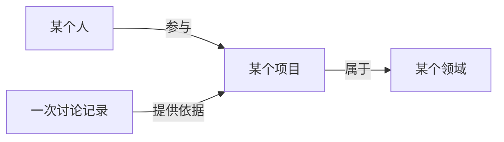

# MyContext：开源结构、检索与 Graph 的设计取舍

MyContext 的核心是管理个人在学业、研究和工作中积累的 context，让 Codex 每次继续工作时，
能知道用户正在做什么、试过什么、哪些结果已被否定、还有哪些问题需要导师或同伴帮助。
主要用户包括学生、研究者和职业起步阶段的工程师。

平台的主要对象是实习经历、技术项目、research ideas、未来项目、学习问题与工作记录。
Skills 提供读取和更新这些资料的工作方法，用户仍然在 Codex 中进行学习与实现。
演示应从真实的工作问题出发：准备导师讨论、梳理实习贡献、接续一个失败的实验，
或发现“看懂了解答”和“能独立完成”之间的差距。

## 演示的内容结构

新版是 Alex Lin（林知远）的完整虚构场景，包含 67 条记录：3 份个人学业背景、6 个领域、
3 段工作经历、10 个项目、8 个研究想法、4 个未来项目想法、8 位虚构协作者、20 篇工作记录
和 5 份待审草稿。院校、机构、人物、经历及实验结果均为虚构。

经历负责角色、时间和贡献范围；项目负责当前实现与限制；想法负责研究问题和首次验证；
日记负责发生过的变化；人物记录负责关系背景和下一次讨论。比如一个早期评估结果发现
数据划分问题后被撤回，当前项目应引用新的结论，旧记录仍解释为什么改了方向。
这样的 context 能帮助 AI 接续工作，也能用于检验它是否会过度宣称成果。

## 开源隔离

公开仓库只包含代码、通用 Skills、空白模板、完全虚构的演示资料。
安装后 `.local/demo/` 是独立 Git 仓库，个人资料也另建独立仓库，默认没有远程。
演示数据只采用通用的组织结构与工作场景，不复制真实个人资料、机构关系、内部材料或历史。

Worktree 是同一个 Git 仓库的另一个工作目录，适合分支并行开发，共享仓库历史。
因此，公开发布最适合从白名单中提取代码，再开始新的 Git 历史。
`.gitignore` 只影响未跟踪文件的默认加入行为，不能清除已提交内容。
参见 [Git worktree 官方说明](https://git-scm.com/docs/git-worktree) 和
[Git ignore 官方说明](https://git-scm.com/docs/gitignore)。

新版本成熟后，可以单独审阅程序、规则、Skills 的差异，再把需要的改进迁入原项目。
不要用整个公开目录覆盖原资料库，也不要把两个 Git 历史合并起来。

## Librarian 值得做多大

几十份到小规模数百份 Markdown，先做轻量检索通常更便于维护。这是本项目的工程判断，
不是宣称某个文件数量就是向量检索的通用分界线。

这版优先做好：明确资料根目录、先排除无权读取的内容、让 ID/标题/别名/标签优先、
返回可解释结果、用少量资料回答并引用文件、没找到就明确说没找到。
Librarian 是这个检索工作流的 Skill，不是另一个常驻服务。

后续是否引入语义检索，应该用实际问题评测：正确资料能否进前五、漏检是什么原因、
同义表达是否频繁失效、跨语言需求有多强、维护成本是否划算。
先积累一组带正确答案的查询，再比较当前检索与候选方案；不要仅因为“RAG 很流行”就加数据库。

## Knowledge Graph 是什么

可以把它理解为“实体 + 有明确含义的关系”。例如下面是虚构的关系示意，
**不是当前演示资料已经确认的事实，也不是本版本支持的关系字段**：

普通链接只表达“A 连到了 B”；带类型的关系能表达“A 参与了 B”。RDF 用
主语、谓语、宾语组成三元组，是一种具体的数据模型。知识图谱并不要求必须使用 RDF、
Neo4j 或某种图数据库。这里引用 RDF 只是帮助解释关系为什么需要有含义。
参见 [W3C RDF 三元组定义](https://www.w3.org/TR/rdf11-concepts/#section-triples)。

现有界面已有局部关系图、反向链接和全局概览，保留即可。
把它做得更好看属于表现层；让它回答“谁参与了什么、何时发生、依据在哪”属于数据模型。
这两件事可以独立推进。一个可能的后续步骤是少量可审阅关系类型、每条关系的来源和时间，
以及点击节点时的路径解释。旧的无类型链接继续保留无类型状态。

这版不增加关系字段或推理引擎；界面只调整为学业与工作的定位，保留原有布局。先验证检索和入门体验，再用真实使用问题
确定图谱升级范围。

## 可以演示的故事

1. 一名新用户克隆代码，运行演示，无需导入个人资料或配置模型密钥。
2. 用自己的 Codex 询问 Eval Notebook 的早期结果为什么撤回，Librarian 找到当前项目与历史记录并引用。
3. 打开 Graph，查看相关人物、项目和记录；说明连线是资料链接。
4. 用户提供一个新事件，AI 准备有来源和差异的更新提案。
5. 用户审阅提案；明确说明应用、提交和同步目前依赖助手执行的文档化流程，
   不是前端已经实现的一键自动执行功能。

演示里的所有人物和经历都必须继续标记为虚构，不代表真实用户。
