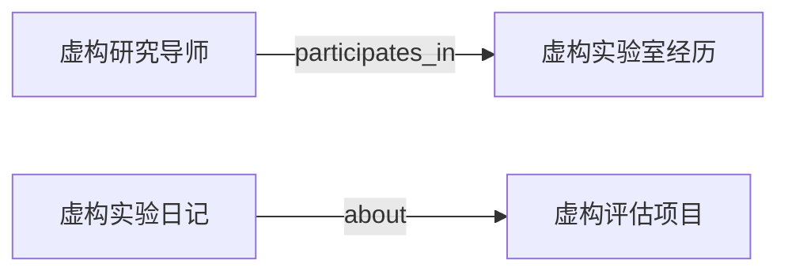

# MyContext：开源结构、检索与 Graph 的设计取舍

MyContext 的核心是管理个人在学业、研究和工作中积累的 context，让 Codex 每次继续工作时，
能知道用户正在做什么、试过什么、哪些结果已被否定、还有哪些问题需要导师或同伴帮助。
主要用户包括学生、研究者和职业起步阶段的工程师。

平台的主要对象是实习经历、技术项目、research ideas、未来项目、学习问题与工作记录。
Skills 提供读取和更新这些资料的工作方法，用户仍然在 Codex 中进行学习与实现。
演示应从真实的工作问题出发：准备导师讨论、梳理实习贡献、接续一个失败的实验，
或发现“看懂了解答”和“能独立完成”之间的差距。

## 演示的内容结构

新版是 Alex Lin（林知远）的完整虚构场景，包含 67 条记录：3 份个人学业背景、6 个领域、
3 段工作经历、10 个项目、8 个研究想法、4 个未来项目想法、8 位虚构协作者、20 篇工作记录
和 5 份待审草稿。院校、机构、人物、经历及实验结果均为虚构。

经历负责角色、时间和贡献范围；项目负责当前实现与限制；想法负责研究问题和首次验证；
日记负责发生过的变化；人物记录负责关系背景和下一次讨论。比如一个早期评估结果发现
数据划分问题后被撤回，当前项目应引用新的结论，旧记录仍解释为什么改了方向。
这样的 context 能帮助 AI 接续工作，也能用于检验它是否会过度宣称成果。

## 开源隔离

公开仓库只包含代码、通用 Skills、空白模板、完全虚构的演示资料。
安装后 `.local/demo/` 是独立 Git 仓库，个人资料也另建独立仓库，默认没有远程。
演示数据只采用通用的组织结构与工作场景，不复制真实个人资料、机构关系、内部材料或历史。

Worktree 是同一个 Git 仓库的另一个工作目录，适合分支并行开发，共享仓库历史。
因此，公开发布最适合从白名单中提取代码，再开始新的 Git 历史。
`.gitignore` 只影响未跟踪文件的默认加入行为，不能清除已提交内容。
参见 [Git worktree 官方说明](https://git-scm.com/docs/git-worktree) 和
[Git ignore 官方说明](https://git-scm.com/docs/gitignore)。

新版本成熟后，可以单独审阅程序、规则、Skills 的差异，再把需要的改进迁入原项目。
不要用整个公开目录覆盖原资料库，也不要把两个 Git 历史合并起来。

## Librarian 值得做多大

几十份到小规模数百份 Markdown，先做轻量检索通常更便于维护。这是本项目的工程判断，
不是宣称某个文件数量就是向量检索的通用分界线。

这版优先做好：明确资料根目录、先排除无权读取的内容、让 ID/标题/别名/标签优先、
返回可解释结果、用少量资料回答并引用文件、没找到就明确说没找到。
Librarian 是这个检索工作流的 Skill，不是另一个常驻服务。

后续是否引入语义检索，应该用实际问题评测：正确资料能否进前五、漏检是什么原因、
同义表达是否频繁失效、跨语言需求有多强、维护成本是否划算。
先积累一组带正确答案的查询，再比较当前检索与候选方案；不要仅因为“RAG 很流行”就加数据库。

## Knowledge Graph 是什么

可以把它理解为“实体 + 有明确含义的关系”。这一版在 Markdown frontmatter 中加入少量、
人工审阅的 `relations` 断言，同时保留原来的 `links`。例如演示中的这条关系：

声明 `relations` 的记录就是主语；`predicate` 表达关系含义，`target` 指向宾语。
当前谓词为 `participates_in`、`part_of`、`about`、`motivated_by`、`supports`、
`contradicts` 和 `supersedes`，每种谓词都限制可用的起点与终点类型。比如
`supersedes` 只连接相同类型的两条记录，避免把“后续日记替代旧协议”误写成项目替代人物。

每条断言还有稳定的关系 ID、evidence、sources、review、privacy，以及可选的
`valid_from`、`valid_to` 和 note。时间字段采用 ISO 日期，表达关系适用的区间。
`evidence: inference` 明确表示关系包含解释；`review: confirmed` 只表示这条断言经过
人工整理，并不把推断变成原始事实。最终显示采用关系、两个端点及它引用的任何
`context:*` 正式来源记录中最严格的隐私级别；缺失或被排除的正式来源会让该关系退出投影。

演示只加入十条可逐条检查的合成断言，且全部使用 `sources: ["demo:fictional"]`。
其中 `artifact` 表示可以在演示记录中检查到明确表述，并不声称存在真实公司的文件、
实验产物或用户证据；`confirmed` 也只确认虚构情节经过整理，不确认任何真人经历。

普通 `links` 仍然只表达“A 连到了 B”，投影保留声明方向，但在旧链接导航与路径中可双向浏览；
它仍是无语义的 `related_to`。系统不会批量猜测旧链接的含义，也不会从正文自动生成事实。带类型的边保持方向、证据、
来源、审阅状态和时间；同一对记录之间的多条不同断言不会被合并。界面可以按谓词、
审阅状态和当前有效性筛选，也可以分别查看有方向的语义路径和包含旧链接的无方向路径。

RDF 用主语、谓语、宾语组成三元组，是一种具体的数据模型。知识图谱并不要求必须使用
RDF、Neo4j 或某种图数据库。这里引用 RDF 只是帮助解释关系为什么需要有含义。
参见 [W3C RDF 三元组定义](https://www.w3.org/TR/rdf11-concepts/#section-triples)。

投影仍只读取所选 context Git 仓库已经提交的 `HEAD`，前端和 Graph API 均为只读。
Graph 现在也包含可见的 journal 与 draft 节点；restricted 记录和排除目录的边不会泄露到
结果中。`schemaVersion: 5` 标识新的投影结构，`/api/v1/graph` 可单独读取图与谓词注册表。
这套实现没有推理引擎，也不会修改 Markdown。

## 可以演示的故事

1. 一名新用户克隆代码，运行演示，无需导入个人资料或配置模型密钥。
2. 用自己的 Codex 询问 Eval Notebook 的早期结果为什么撤回，Librarian 找到当前项目与历史记录并引用。
3. 打开 Graph，查看人物、项目、journal 和 draft；区分带来源与审阅状态的有向关系和旧的无类型链接。
4. 在另一个课程或研究项目里调用全局 My Context Skill，让 AI 记录一次有来源的实验结果。
5. 默认结果进入资料库外的私有待审队列；如果资料库单独批准了自动记录策略，
   则由命令追加一篇私有工作日记并在本地提交。已有项目页的修改仍需审阅，自动记录不会 push。

跨项目使用依赖明确的资料库绑定，不会从当前目录猜测资料库或退回虚构演示。
Skill 从当前任务已知的内容中摘取结论，不扫描其他会话，也不是保证每次会话结束都会运行的后台程序。
前端继续只读；待审队列不作为正式事实显示。安装、输入格式和策略启用步骤见
[README](../README.md#capture-from-any-project) 与 [capture guide](../skills/my-context/references/capture.md)。

演示里的所有人物和经历都必须继续标记为虚构，不代表真实用户。
