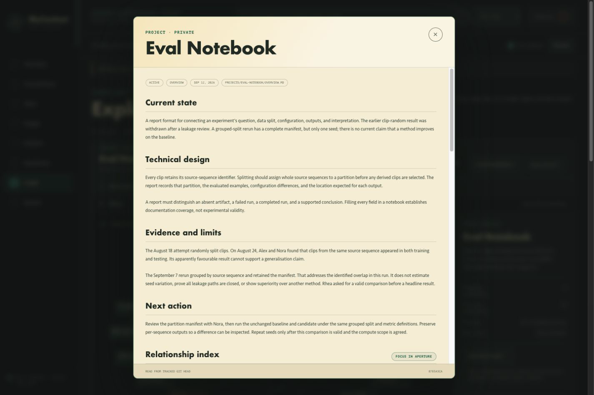

# Four ways to continue your work

Each example follows Alex Lin, the demo's fictional computer science student.
Ask these prompts in your local AI assistant with the demo selected. MyContext
supplies the records; your assistant produces the explanation, brief, or plan.
The outputs below illustrate what the recorded context supports.

*Screenshot from the demo before the frontend redesign.*

## Research checkpoint

You are returning to an experiment before a lab meeting. Its earlier result
looked promising, but the evaluation protocol changed.

> Use $my-context to prepare a short research checkpoint for Eval Notebook.
> Explain why the first result was withdrawn, what the rerun establishes,
> and the next comparison I should discuss with Nora. Cite the records.

**Context used:** [current project](../examples/demo/projects/eval-notebook/overview.md),
[leakage finding](../examples/demo/journal/2026/2026-08-24-eval-leakage.md), and
[grouped-split rerun](../examples/demo/journal/2026/2026-09-07-eval-rerun.md).

**Grounded output:** The original split put clips from the same source sequence
in training and testing, so that result was withdrawn. The grouped-split rerun
has a complete manifest and one seed. Next, review the manifest with Nora and
compare the unchanged baseline and candidate using the same split and metrics.
The current notes support a protocol correction, with comparative performance
still unresolved.

## Internship portfolio

You need a concise contribution summary for a portfolio and want to preserve
the scope of the work you actually completed.

> Use $my-context to draft two portfolio bullets about my Meridian internship.
> Separate my contribution from the team's work and identify wording that still
> needs Evan's review.

**Context used:** [internship overview](../examples/demo/experience/meridian-internship/overview.md),
[Motion Atlas](../examples/demo/projects/motion-atlas/overview.md), and
[contribution review draft](../examples/demo/experience/meridian-internship/drafts/2026-09-12-internship-scope.md).

**Grounded output:** One bullet can describe contributions to the transition
prototype and inspection of 12 handpicked pairs, including unresolved sharp-turn
cases. Another can describe the FrameBridge export that keeps reviewer comments
with an asset version. The summary keeps collaboration visible and flags the
wording for Evan's review; production adoption and measured speedups have no
supporting record.

## Learning gap

You remember understanding backpropagation in a guided session. Before moving
on, you want to know whether you can use it independently.

> Use $my-context to check where I am with gradients. Then give me one short
> problem without the solution, and offer one hint at a time if I get stuck.

**Context used:** [StudyMap](../examples/demo/projects/study-map/overview.md),
[no-notes recall gap](../examples/demo/journal/2026/2026-04-10-recall-gap.md), and
[later self-check](../examples/demo/journal/2026/2026-04-17-study-recheck.md).

**Grounded output:** Alex followed the guided explanation, struggled during a
later attempt without notes, then solved one different example independently.
The next exercise should change the dependency graph and ask for intermediate
reasoning. One successful attempt is retained as progress while the topic stays
in review. Your assistant generates the new exercise from that learning context.

## Future project idea

You have an idea for a useful research tool and want a small validation step
before committing to implementation.

> Use $my-context to turn the Experiment Index idea into a first validation
> task. Connect it to problems I encountered in Eval Notebook, state what I
> should check with Nora, and keep the idea separate from implemented work.

**Context used:** [Experiment Index idea](../examples/demo/ideas/projects/experiment-index.md)
and [Eval Notebook](../examples/demo/projects/eval-notebook/overview.md).
An explicit idea lookup includes draft records.

**Grounded output:** Create four example run records: planned, failed before
evaluation, completed on an invalid split, and corrected rerun. Check with Nora
whether a query about usable comparison evidence returns the corrected record
and explains why the earlier one is invalid. This tests the proposed organization
before building a tracker. The idea remains a proposal.

## Carry the outcome into the next session

After working through a scenario in your own library, ask:

> Use $my-context to retain the decision we made, the evidence we checked,
> the remaining limitation, and the next step. Report the capture receipt.

The default result is **queued for review**. A library that has separately enabled
automatic journal capture receives a **local journal commit**. Existing project
pages are updated through their review workflow. See [cross-project setup](getting-started.md#capture-from-another-project).
